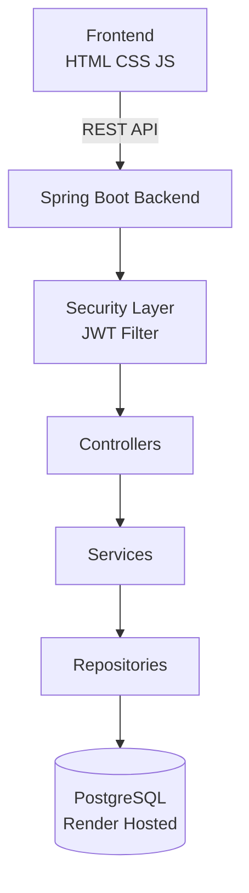

# 🎮 Fusion2048 – Full Stack Web Application

*Fusion2048 is a production-ready full-stack web application built using Spring Boot and PostgreSQL with manual JWT-based authentication and a vanilla JavaScript frontend.*
*The system implements secure stateless authentication, persistent score storage, and layered backend architecture.*

# 🌐 Live Application
*https://fusion2048.vercel.app/*

# 🏗 System Architecture

# 🔐 Authentication Flow (Manual JWT Implementation)

*1. User submits login credentials*  
*2. Password validated using BCrypt*  
*3. JWT token generated using secret key*  
*4. Custom JWT filter intercepts every request*  
*5. Token validated before accessing protected endpoints*  
*6. Stateless authentication*

# 🚀 Tech Stack
# Frontend
*HTML
CSS
JavaScript*

# Backend
*Java
Spring Boot
Spring Security
Custom JWT Filter
JPA / Hibernate*

# Database
*PostgreSQL (Render)*

# Deployment
*Frontend deployed on Vercel* 
*Backend & PostgreSQL deployed on Render* 
*Environment variables for secrets*

# 📡 Core Features 
**User Registration** 
Encrypted Password Storage (BCrypt) 
Manual JWT Authentication 
Stateless Session Management 
Persistent Score Tracking 
RESTful API Architecture 
Production Deployment

# 🗄 Database Schema Overview
User
id
username (unique)
password (encrypted)

Score
id
user_id (foreign key)
score
timestamp

# ⚙️ Run Locally
**Backend** 
`mvn clean install` 
`mvn spring-boot:run`

**frontend** 
`Open index.html`

# 📸 Application Screenshots

